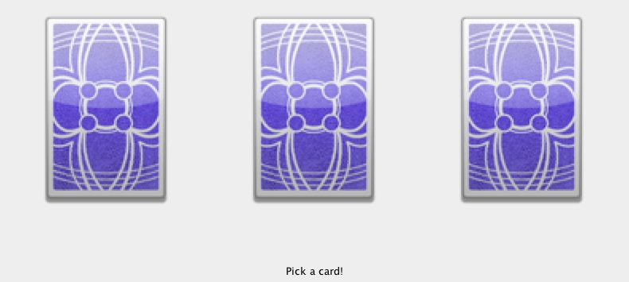

#Drawing Card Game

A simple card game written in Java

##Rules

- Three unknown cards will be available for user to select 						

 

 

- Computer will pick after the player												
- The two cards will be compared, based on suit and rank of the card		
																				
Regardless of the suit, the card with higher rank will win							

	Player				Computer
	Heart 9				Spade 8
	[Winner]

Suit orders are as follow, with highest to lowest:

	♠ 		> ♥			> ♣			> ♦
	Spades	> Hearts	> Clubs		> Diamonds

In the case with same rank, the card with higher suit will win

	Player				Computer
	Heart 8				Spade 8
						[Winner]

Click on any card to start a next round										
																				
#Disclaimer
I do not own the copyright of the card images